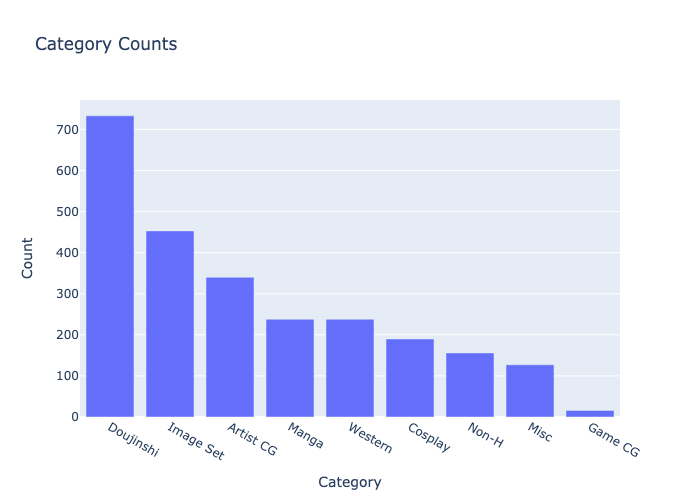

# E-HENTAI TRACKER
Track the most recent popular quality posts on the e-hentai.org based on the download counts of the torrent files.

This script scrap the most recent n pages of posts with 4 star + rating on e-hentai, then associate each tag with total download count. The most popular tags will be displayed.

To prevent getting blocked by the website, change the headers in main.py. The script runs slow since it will sleep for some seconds after each request to e-hentai.org

Some data gathered from E-hentai.org. Only galleries with 4 stars + ratings are included. Link:  <a href="https://mega.nz/file/GB5jUI7R#RIEKgVwIFFpc5lXv8t_tx5SBDipYdy0qubXXXSeQH8k" target="_blank">Mega Drive</a>

Some small functinalities in util:
| Function | Description |
| --- | --- |
| listGalleryWithTag | List the galleries with a certain tag from the scraped data |
| previewPage | Get one random image from the first page of a gallery |
| getThumbNail | Get the thumbnail of a gallery |
| qualitySearch | Get the top download gallery with tag/catergory query from scraped data |

Example plots:

